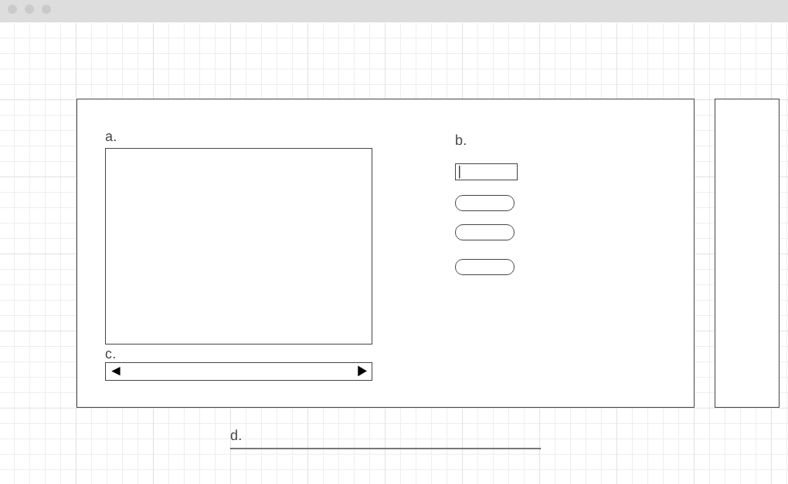

# MetArt

## Overview

The Metropolitan Museum of Art's collection is world-class. Is it worldly? I plan to use The Metropolitan Museum of Art Collection API to delve deeper into the origins of its pieces. Particularly, I'd like to examine the country of origin of artworks by medium, by year, and whether the piece of art is designated a "highlight" or even on display.

## Functionality & MVPs

MetArt users are are able to:

- See a broad overview of the museums's collection by country of origin
- Examine the museum's collection by country of origin to explore medium and other details
- Explore the geographic distribution of the museum's collection by year of creation
- Filter the museum's collection by 'highlight' and 'on-view' designation

## Data & APIs

Artwork information is available for free through The Metropolitan Museum of Art Collection API which provides information on the museum's 450,000 artworks.

## Wireframe
Mapping the Met will be consist of a single page that allows users to view a world map (a) of data for all countries or filter by a particular country (b) to get country-specific information (d). User can also use a sliding timescale to adjust information on global distribution of artworks (e). A sidebar (c) and footer (f) will contain author and dataset information.

## Design

## Architecture & Technologies

MetArt is built with:

- JavaScript for data retrieval and computation
- DS.js for data visualization
- Webpack and Babel to bundle files

## Implementation Timeline
Day 1
- 4 hrs: D3 tutorials
- 2 hrs: API familiarization and assessment of required preprocessing
- 2 hrs: Project setup including Webpack
- GOAL: Learn enough D3 and API to get something rendered
Day 2
- 4 hrs: API familiarization
- 4 hrs: Data preprocessing and API requests written, tested, working
- GOAL: Get API requests connected correctly
Day 3
- 4 hrs: Render API return
- 4 hrs: User input fires off API requests and updates render
- GOAL: Get render to reflect API requests
## Bonus Features

- Exploration by year of acquisition
