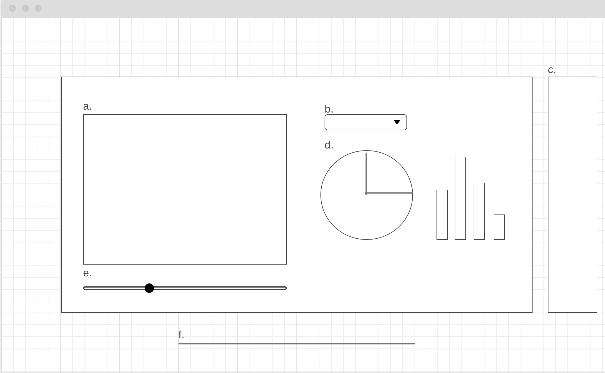

# MetArt

## Overview

The Metropolitan Museum of Art's collection spans media, millenia, and locations. Wandering through galleries and departments reveals the wide range of artworks but I'm interested in using The Metropolitan Museum of Art Collection API to delve deeper into the origins of its pieces. Particularly, I'd like to examine the country of origin of artworks by medium, by year, and whether the piece of art is designated a "highlight".

## Functionality & MVPs

MetArt users are are able to:

- Explore the museum's collection by country of origin
- Explore the museum's collection by medium
- Explore the museum's collection by year
- Explore the museum's collection by 'highlight' designation

## Data & APIs

Artwork information is available for free through The Metropolitan Museum of Art Collection API which provides information on the museum's 450,000 artworks.

## Wireframe

## Design

## Architecture & Technologies

MetArt is built with:

- JavaScript for data retrieval and computation
- DS.js for data visualization
- Webpack and Babel to bundle files

## Bonus Features

- Exploration by year of acquisition
- Exploration by gender in addition to country of origin (will require additional dataset)
