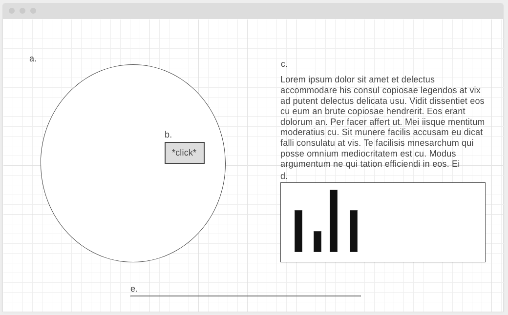

# Mapping the Met

**Mapping the Met** uses The Metropolitan Museum of Art Collection API to delve deeper into the origins of its pieces and allows the user to examine the country of origin of artworks by year, and whether the piece of art is designated a "highlight" or even on display. 

[Live Site](http://mappingthemet.herokuapp.com/)

## Tech/Framework Used
**Mapping the Met** was built with
+ JavaScript for data retrieval and computation
+ DS.js for data visualization
+ External API (The Metropolitan Museum of Art Collection API) for data source
+ Webpack and Babel to bundle files

## Features
+ Global overview of the museums's collection by country of origin
+ Examine the museum's collection by country of origin to explore 'on-view' and 'highlight' designation
+ Explore the museum's collection by country of orgin and year of creation

## Feature Highlights
+ Clickable globe to examine collection by country

+ Detailed breakdown of collection by country

## Data & APIs

Artwork information is available for free through The Metropolitan Museum of Art Collection API which provides information on 450,000 of the museum's two million artworks.

## Wireframe
Mapping the Met will consist of a single page that allows users to view a world map (a) of data for all countries or filter by a particular country (b) to get country-specific information (d). User can also use a sliding timescale to adjust information on global distribution of artworks (e). A sidebar (c) and footer (f) will contain author and dataset information.

## Future Features
+ Exploration by year of acquisition
